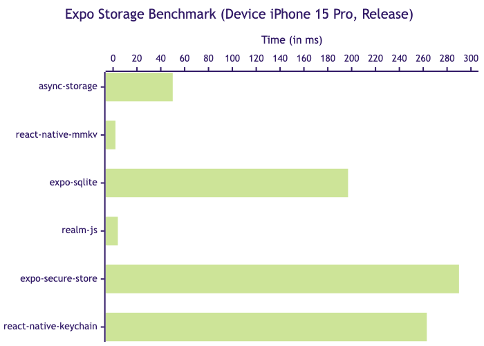
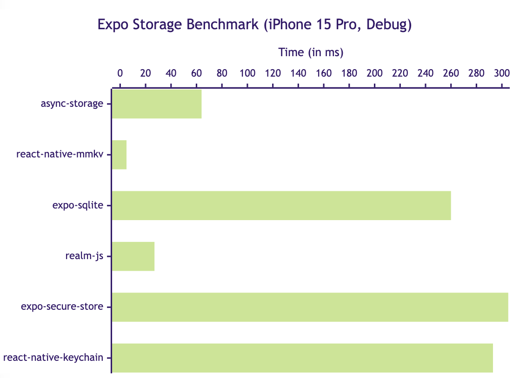
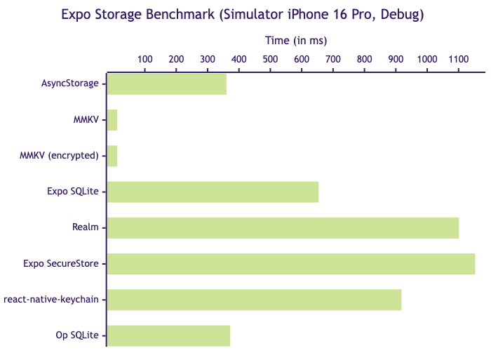

# Expo Storage Benchmark

This is a benchmark app to compare popular storage solutions for Expo (React Native).

It's running Expo 52, React Native 0.76, with New Architecture enabled.

The benchmark consists of calling a **_set_ operation a thousand times**, followed by a **_get_ operation a thousand times**. The keys are preshuffled, and are in different order for the set and get operations, but the same for each library.

Here are the results (average of 5 runs), ranked from fastest to slowest:

1. [MMKV](https://github.com/mrousavy/react-native-mmkv): **15ms** 👑
2. [Op SQLite](https://github.com/op-engineering/op-sqlite): **626ms**
3. [Expo-SQLite](https://github.com/expo/expo/tree/master/packages/expo-sqlite): **793ms**
4. [AsyncStorage](https://github.com/react-native-async-storage/async-storage): **898ms**
5. [react-native-keychain](https://github.com/oblador/react-native-keychain): **1014ms**
6. [Expo SecureStore](https://github.com/expo/expo/tree/master/packages/expo-secure-store): **1284ms**
7. [Realm](https://github.com/realm/realm-js): **2418ms**

I would like to add [react-native-nitro-sqlite](https://github.com/mrousavy/react-native-nitro-sqlite) to the benchmark. If someone wants to help me set up nitro modules with expo, ping me, or make a PR, I'd be very grateful!

  

  

  

## Run it

1. Clone the repo and navigate to it.
2. Run `bun install`.
3. Run `bun prebuild` to generate local native folders, or you can use EAS to build the app.
4. Run `bun dev` and start the app from Xcode or Android Studio.

### Hardware

The above results were tested on a device iPhone 15 Pro (both debug and release mode) and a simulator iPhone 16 Pro (debug mode). Results may differ on different iPhones or Android Phones. Feel free to test on your own device, and report back your results in a GH issue.

### Operations

The above results were tested using _get_ operations for a single string key (value: `'hello'`). Results may differ when using other operations, such as _set_, _delete_, _update_, and more.
