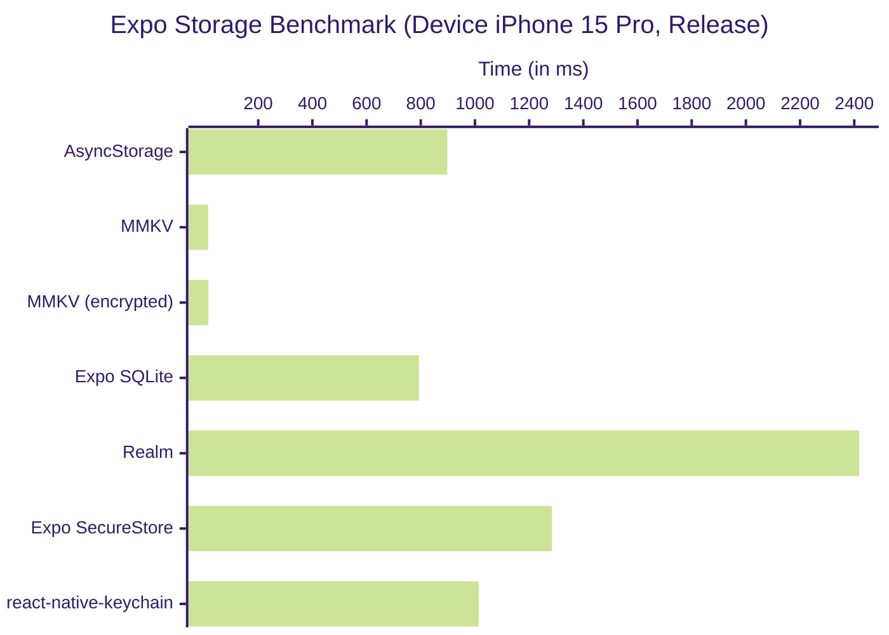
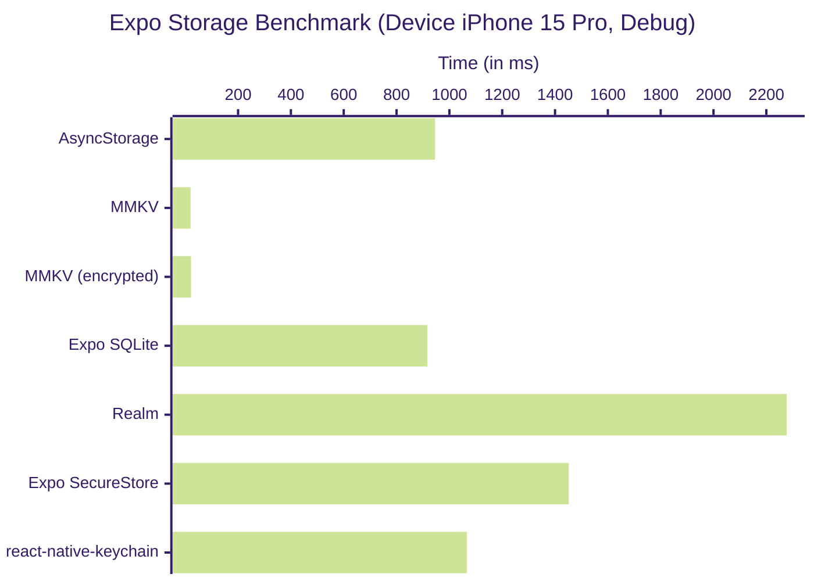
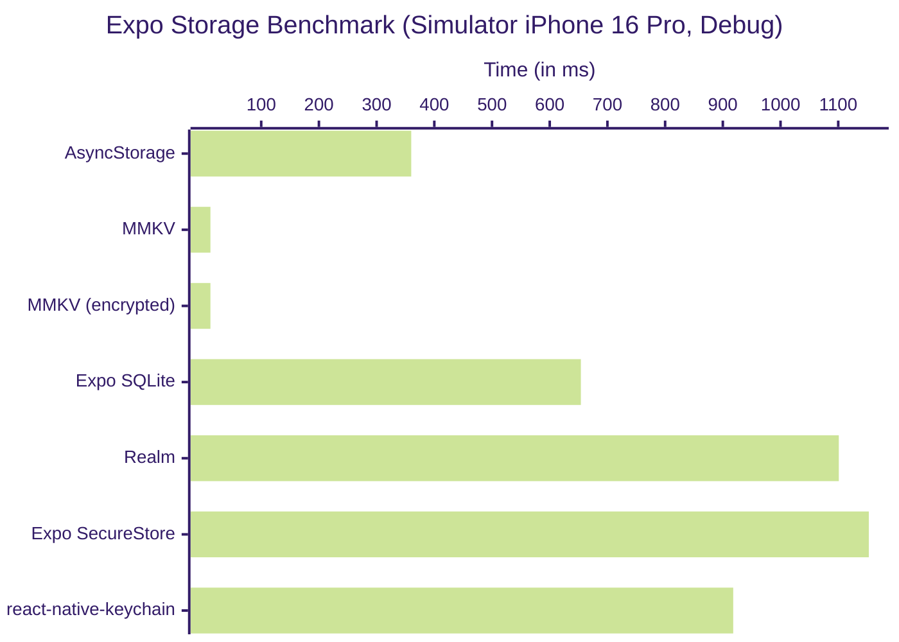

## Device Release

```mermaid
%%{init: {'theme': 'forest'}}%%
xychart-beta horizontal
    title "Expo Storage Benchmark (Device iPhone 15 Pro, Release)"
    x-axis ["AsyncStorage", "MMKV", "MMKV (encrypted)", "Expo SQLite", "Realm", "Expo SecureStore", "react-native-keychain"]   
    y-axis "Time (in ms)"
    bar [898, 15, 16, 793, 2418, 1284, 1014]
```

## Device Debug

```mermaid
%%{init: {'theme': 'forest'}}%%
xychart-beta horizontal
    title "Expo Storage Benchmark (Device iPhone 15 Pro, Debug)"
    x-axis ["AsyncStorage", "MMKV", "MMKV (encrypted)", "Expo SQLite", "Realm", "Expo SecureStore", "react-native-keychain"]
    y-axis "Time (in ms)"
    bar [946, 20, 22, 917, 2277, 1452, 1066]
```

## Simulator Debug

```mermaid
%%{init: {'theme': 'forest'}}%%
xychart-beta horizontal
    title "Expo Storage Benchmark (Simulator iPhone 16 Pro, Debug)"
    x-axis ["AsyncStorage", "MMKV", "MMKV (encrypted)", "Expo SQLite", "Realm", "Expo SecureStore", "react-native-keychain"]
    y-axis "Time (in ms)"
    bar [360, 12, 12, 654, 1101, 1153, 918]
```
